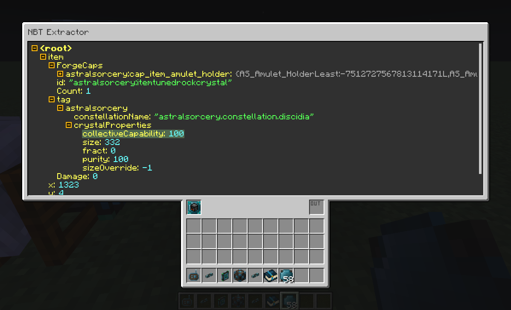

# Integrated NBT
Integrated NBT is an addon for Minecraft mod [Integrated Dynamics](https://github.com/CyclopsMC/IntegratedDynamics). It adds a simple and fast way of extracting deeply nested values from a complex NBT variable via a graphical user interface.

See GitHub Wiki for a brief tutorial on how to use this mod.
