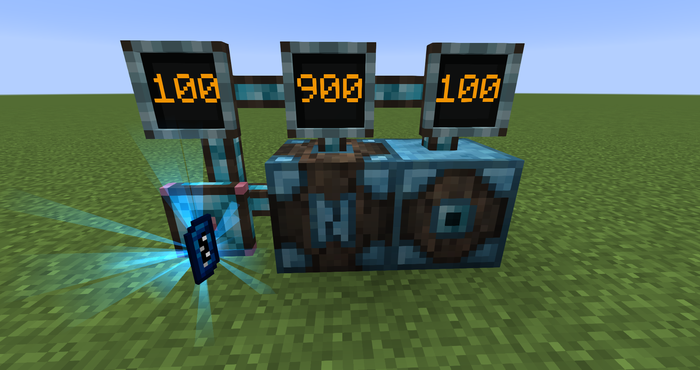
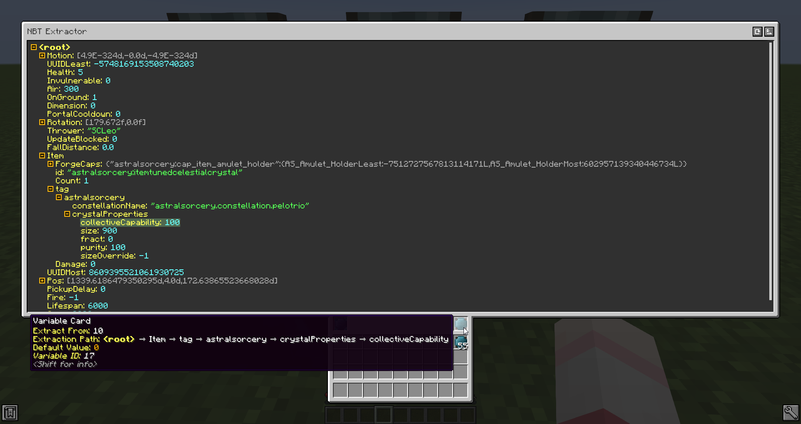

# Integrated NBT
Integrated NBT is an addon for Minecraft mod [Integrated Dynamics](https://github.com/CyclopsMC/IntegratedDynamics). It adds a simple and fast way of extracting deeply nested values from a complex NBT variable via a graphical user interface.

Screenshots:

Support for different output modes:

GUI is responsive and usable across all GUI scales and screen resolutions:

See [GitHub Wiki](https://github.com/SCLeoX/IntegratedNBT/wiki) for a brief tutorial on how to use this mod.
